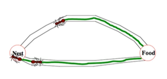

**Author:** Beatrice Occhiena s314971. See [`LICENSE`](https://github.com/beatrice-occhiena/Computational_intelligence/blob/main/LICENSE) for details.
- institutional email: `S314971@studenti.polito.it`
- personal email: `beatrice.occhiena@live.it`
- github repository: [https://github.com/beatrice-occhiena/Computational_intelligence.git](https://github.com/beatrice-occhiena/Computational_intelligence.git)

**Resources:** These notes are the result of additional research and analysis of the lecture material presented by Professor Giovanni Squillero for the Computational Intelligence course during the academic year 2023-2024 @ Politecnico di Torino. They are intended to be my attempt to make a personal contribution and to rework the topics covered in the following resources.
- [https://github.com/squillero/computational-intelligence](https://github.com/squillero/computational-intelligence)
- Lessons: 21/12/2023
- Stuart Russel, Peter Norvig, *Artificial Intelligence: A Modern Approach* [3th edition]
- Sean Luke, *Essentials of Metaheuristics*, 2016 [online version 2.3]

.

.

# Multi-Agent Systems

## Table of Contents

- [Introduction](#introduction)
- [Swarm Intelligence](#swarm-intelligence)
  - [Individual Agents](#individual-agents)
  - [Boids (Bird-oid objects)](#boids-bird-oid-objects)
  - [Particle Swarm Optimization (PSO)](#particle-swarm-optimization-pso)
    - [Pseudo-code](#pseudo-code)
    - [Velocity Update](#velocity-update)
  - [Ant Colony Optimization (ACO)](#ant-colony-optimization-aco)
    - [Pseudo-code](#pseudo-code-1)
    - [Update Pheromone Trails](#update-pheromone-trails)
  - [Artificial Bee Colony (ABC)](#artificial-bee-colony-abc)
  - [Differential Evolution (DE)](#differential-evolution-de)

## Introduction
Multi-Agent Systems (MAS) are systems composed of **multiple interacting agents**. Each agent is an `autonomous entity` that can perceive its environment, reason, and act to achieve its individual goals.

The agents can also:
- communicate with each other
- coordinate their actions
- share information
- collaborate to solve problems or compete to achieve their respective goals

> 🎯 The goal is to study the **behavior of the system as a whole**, considering the interactions between the agents and the environment.

MAS problems are complex, computationally hard, and often involve uncertainty. They are studied in the field of `Distributed Artificial Intelligence` and are used to model and solve problems in various domains, such as:
- Economics: e.g., auctions, markets, and negotiation
- Robotics: e.g., multi-robot systems
- Social sciences: e.g., modeling human behavior
- Computer science: e.g., distributed systems and networks

## Swarm Intelligence

Swarm Intelligence is a subfield of MAS that studies the `collective behavior` of **decentralized, self-organized systems**. It is used to model and solve problems in various domains, such as:
- Traffic Flow
- Crowd Dynamics
- Drone Swarms

🐝 It is inspired by the collective behavior of social insects, such as ants, bees, and termites, and studies the principles that allow a group of agents to work together to achieve a common goal 🐝🐝...🐝

### Individual Agents
Single agents in a swarm are usually similar to each other, simple, with limited capabilities and local information.
- **Simple Rules**: Agents follow simple rules to interact with each other and the environment.
- **No Central Control**: There is no central control or leader, and the agents interact with each other based on local information.
  - Decentralized control allows the system to be robust and scalable.
- **Emergent Behavior**: The collective behavior of the swarm emerges from the interactions between the agents.

### Boids (Bird-oid objects)
Boids are a classic example of a swarm model. They are used to simulate the flocking behavior of birds and other animals. The model is based on three simple rules:
1. **Separation**: Avoid collisions with nearby agents.
2. **Alignment**: Align the direction of movement and speed with nearby agents.
3. **Cohesion**: Move towards the center of mass of nearby agents, to stay near neighbors.

### Particle Swarm Optimization (PSO)
PSO is a population-based optimization algorithm inspired by the social behavior of birds and fish. It is used to solve optimization problems and is based on the following principles:
- **Population**: A set of candidate solutions (particles) that move in the search space.
- **Velocity**: Each particle has a velocity that determines its movement in the search space.
- **Best Position**: Each particle remembers its best position in the search space.
- **Global Best Position**: The best position found by the entire swarm.

> It is an alternative to evolutionary algorithms, which main idea is to `"fly" through the solution space`, adjusting its position according to its own experience and the experience of its neighbors.

#### Pseudo-code

```python
# Pseudo-code of the PSO algorithm
initialize swarm
for each particle in the swarm:
    initialize particle
    evaluate particle
    if particle is better than the best particle:
        update best particle
while stopping criterion is not met:
    for each particle in the swarm:
        update velocity
        update position
        evaluate particle
        if particle is better than the best particle:
            update best particle
```
#### Velocity Update
The velocity of each particle is updated based on its current velocity, its best position, and the global best position. The update is based on the following formula:

$v_{i}(t+1) = w \cdot v_{i}(t) + c_{1} \cdot r_{1} \cdot (p_{i} - x_{i}) + c_{2} \cdot r_{2} \cdot (p_{g} - x_{i})$

where:
- $v_{i}(t)$ is the velocity of particle $i$ at time $t$
- $w$ is the inertia weight
- $c_{1}$ and $c_{2}$ are the acceleration coefficients
- $r_{1}$ and $r_{2}$ are random numbers in the range $[0, 1]$
- $p_{i}$ is the best position of particle $i$
- $p_{g}$ is the global best position
- $x_{i}$ is the current position of particle $i$

### Ant Colony Optimization (ACO)
ACO is another example of optimization algorithm inspired by the behavior of social insects and their ability to find the `shortest path` between their nest and a food source. 🐜...🐜🐜



> The communication between the ants is based on the use of `pheromones`, which are chemical substances that are deposited on the ground and used to communicate information about the quality of the path.
- The pheromone trail is a form of **indirect communication** that uses the environment to store information about the paths.
- The pheromone trail **evaporates** over time, so the ants prefer the shortest paths, which are reinforced by the pheromones.

#### Pseudo-code

```python
# Pseudo-code of the ACO algorithm
initialize pheromone trails
while stopping criterion is not met:
    for each ant:
        construct solution
        evaluate solution
        update pheromone trails
```

#### Update Pheromone Trails
The pheromone trails are updated based on the quality of the solutions found by the ants. The update is based on the following formula:

$\tau_{ij}(t+1) = (1 - \rho) \cdot \tau_{ij}(t) + \sum_{k} \Delta\tau_{ij}^{k}$

where:
- $\tau_{ij}(t)$ is the amount of pheromone on edge $(i, j)$ at time $t$
- $\rho$ is the evaporation rate
- $\Delta\tau_{ij}^{k}$ is the amount of pheromone deposited by ant $k$ on edge $(i, j)$

### Artificial Bee Colony (ABC)
ABC is another optimization algorithm inspired by the foraging behavior of honey bees. 

> The key idea is to consider **different types of bees**, each with a specific role in the colony:
- 🐝 **Employed bees**: search for food sources and share information about the quality of the sources with other bees.
- 🐝 **Onlooker bees**: observe the dances of the employed bees and choose a food source based on the information received.
- 🐝 **Scout bees**: search for new food sources when the quality of the known sources decreases.

### Differential Evolution (DE)
DE is a population-based optimization algorithm that is inspired by the process of natural selection. It is used to solve optimization problems and is based on the following principles:
- **Population**: A set of candidate solutions (`vectors`) that evolve over time.
- **Mutation**: Each vector is mutated to create a new candidate solution.
- **Crossover**: The new candidate solution is combined with the original vector to create a trial vector.
- **Selection**: The trial vector is selected based on its fitness.