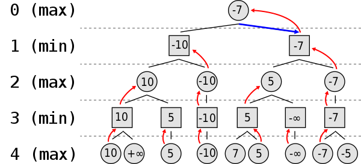
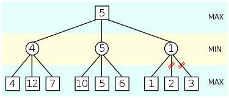
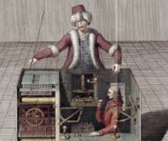

**Author:** Beatrice Occhiena s314971. See [`LICENSE`](https://github.com/beatrice-occhiena/Computational_intelligence/blob/main/LICENSE) for details.
- institutional email: `S314971@studenti.polito.it`
- personal email: `beatrice.occhiena@live.it`
- github repository: [https://github.com/beatrice-occhiena/Computational_intelligence.git](https://github.com/beatrice-occhiena/Computational_intelligence.git)

**Resources:** These notes are the result of additional research and analysis of the lecture material presented by Professor Giovanni Squillero for the Computational Intelligence course during the academic year 2023-2024 @ Politecnico di Torino. They are intended to be my attempt to make a personal contribution and to rework the topics covered in the following resources.
- [https://github.com/squillero/computational-intelligence](https://github.com/squillero/computational-intelligence)
- Lessons: 27/11/2023, 28/11/2023, 
- Stuart Russel, Peter Norvig, *Artificial Intelligence: A Modern Approach* [3th edition]
- Sean Luke, *Essentials of Metaheuristics*, 2016 [online version 2.3]
- [https://it.wikipedia.org/wiki/Potatura_alfa-beta](https://it.wikipedia.org/wiki/Potatura_alfa-beta)
- [https://en.wikipedia.org/wiki/Minimax](https://en.wikipedia.org/wiki/Minimax)
- [https://en.wikipedia.org/wiki/Claude_Shannon](https://en.wikipedia.org/wiki/Claude_Shannon)
- [https://spectrum.ieee.org/claude-shannon-information-theory](https://spectrum.ieee.org/claude-shannon-information-theory)

.

.

# Adversarial Search

## Table of Contents
- [Introduction](#introduction)
- [The role of games in AI](#the-role-of-games-in-ai)
  - [Taxonomy of games](#taxonomy-of-games)
  - [Games vs. Search problems](#games-vs-search-problems)
  - [Game tree](#game-tree)
- [Minimax algorithm](#minimax-algorithm)
  - [Algorithm](#algorithm)
  - [Pseudocode](#pseudocode)
  - [Alpha-Beta pruning](#alpha-beta-pruning)
- [Chess and AI](#chess-and-ai)
  - [The Turk (1857)](#the-turk-1857)
  - [El Ajedrecista (1912)](#el-ajedrecista-1912)
  - [Turochamp (1948)](#turochamp-1948)
  - [Claude Shannon (1950)](#claude-shannon-1950)
  - [The Kotok-McCarthy program (1959-1962)](#the-kotok-mccarthy-program-1959-1962)
  - [Deep Thought (1986)](#deep-thought-1986)
  - [Deep Blue (1996)](#deep-blue-1996)
  - [Final Considerations](#final-considerations)
- [Stochastic games](#stochastic-games)
  - [Stochastic Minimax](#stochastic-minimax)


## Introduction
⚔️ Adversarial search is a type of search in artificial intelligence that is used in multi-agent environments where one agent’s success is another’s failure, i.e., in **competitive environments**.

This is common in games like chess or tic-tac-toe, where two players compete and only one can win.

> The search strategy involves `predicting the opponent’s moves` and choosing the best response to those moves.

## The role of games in AI
🎮 Games have been a central focus of AI research since its inception. They provide a well-defined, structured environment in which to study and compare different AI techniques. They also provide a way to measure progress in AI research.
- Hallmark of intelligence
- Easy to formalize
- Model complex real-world competitive/cooperative activities (economics, military, politics, etc.)

> The goal is to find the best **policy**, i.e., the best move in each state.

### Taxonomy of games
- **Perfect information**: Both players know the state of the game at all times (e.g., chess, checkers).
- **Imperfect information**: Players do not have access to all the information about the state of the game (e.g., card games, poker).
---
- **Deterministic**: The outcome of each action is known (e.g., chess, checkers).
- **Stochastic**: The outcome of each action is uncertain (e.g., dice, cards).
---
- **Turn-based**: Players take turns to make their moves and the environment evolves only after each move (e.g., table games).
- **Real-time**: Players make their moves simultaneously and the environment evolves continuously (e.g., video games).
---
> - **Zero-sum**: The gain of one player is the loss of the other. The sum of the gains is zero. (e.g., chess, checkers, go).
> - **Non-zero-sum**: The gain of one player does not imply the loss of the other. The sum of the gains is not zero. Most of real-world situation (e.g., cooperative games, economic games, nuclear war).

### Games vs. Search problems
🗺️ In search problems, the goal is to find a `fixed sequence of actions` that leads to a percise **goal state**.

> 🎮 In games, the goal is to find a `strategy` that leads to a good outcome, i.e., a mapping from a state to the **best move in that state** to reach a favourable outcome.
- Uncertainty about the opponent's moves
- Time constraints for making decisions
- The search space is too large to be explored completely! Pruning is not sufficient.

### Game tree
🌳 A game tree is a tree that represents all the possible moves of a game. The root of the tree is the initial state of the game, and the children of each node are the possible moves from that state.
- **Branching factor**: The number of children of a node.
- **Depth**: The number of levels in the tree. Each level corresponds to a move of one of the players.
- **Symmetry**: When the same state can be represented in different ways. It is important to avoid redundant exploration of the search space.

## Minimax algorithm
Minimax is one of the most popular algorithms for adversarial search. Introduced by *John von Neumann*, it was rediscovered by *Alan Turing* and *Claude Shannon*.

> 🎯 The goal is to **minimize** the possible loss for a worst-case (maximum loss) scenario.

Therefore, the algorithm is based on the following assumptions:
1. The opponent plays optimally.
2. The game is zero-sum.

> ⚠️ Remember! *Maximizing the chances of winning* **IS NOT THE SAME** as minimizing the maximum possible loss!

- **Stock market**: you can maximize your chances of winning by investing in high-risk stocks, but you can also lose a lot of money. 

- Minimax is about minimizing the maximum possible loss, so it is a more conservative approach. To minimize the maximum possible loss in the stock market, you would not invest at all! And that is not a good strategy.

### Algorithm
In the minimax algorithm, we explore the game tree using a **depth-first search**. We evaluate the nodes at the bottom of the tree using a `heuristic function`.
- Nowadays, the heuristic function is often learned from data using *machine learning* techniques.



We have to **limit the depth** of the search, as the number of nodes in the tree grows exponentially.
- 🌅 `Horizon effect`: We can incorrectly evaluate the value of a state by overlooking a move that is *just beyond the depth limit*. Possible solutions are:
  - **Quiescence search**: We extend the search until a stable state is reached.
  - **Singular Extension**: We extend the search when we encounter a state that is significantly better than the others.

### Pseudocode
```python
def minimax(node, depth, maximizingPlayer):
    if depth == 0 or node is a terminal node:
        return the heuristic value of node
    if maximizingPlayer:
        value = -∞
        for child in node:
            value = max(value, minimax(child, depth - 1, False))
        return value
    else:
        value = +∞
        for child in node:
            value = min(value, minimax(child, depth - 1, True))
        return value
```

### Alpha-Beta pruning
✂️ Alpha-Beta pruning is a technique to reduce the number of nodes that are evaluated in the search tree. 
> It is based on the observation that we can stop evaluating a move when we have found a better alternative already.
- **Alpha**: The best value that the maximizer currently can guarantee at that level or above.
- **Beta**: The best value that the minimizer currently can guarantee at that level or above.

Given the depth-first search nature of the minimax algorithm, the pruning efficiency is highly **dependent on the order** in which the nodes are explored.

> ⚠️ Alpha-Beta pruning **DOES NOT** *change the final result* of the minimax algorithm, it just reduces the number of nodes that are evaluated!



```python
def alphabeta(node, depth, alpha, beta, maximizingPlayer):
    if depth == 0 or node is a terminal node:
        return the heuristic value of node
    if maximizingPlayer:
        value = -∞
        for child in node:
            value = max(value, alphabeta(child, depth - 1, alpha, beta, False))
            alpha = max(alpha, value)
            if alpha >= beta:
                break
        return value
    else:
        value = +∞
        for child in node:
            value = min(value, alphabeta(child, depth - 1, alpha, beta, True))
            beta = min(beta, value)
            if alpha >= beta:
                break
        return value
```

## Chess and AI

### The Turk (1857)


First chess-playing machine, a mechanical automaton that was presented as an automaton that could play chess. It was a **hoax**, as it was operated by a human chess master hidden inside.

### El Ajedrecista (1912)
The first chess-playing automaton that was capable of playing a full game of chess. It was built by Leonardo Torres y Quevedo, a Spanish engineer and mathematician.

### Turochamp (1948)
The first chess-playing program, written by Alan Turing. It was a simple algorithm that could play a full game of chess with a `list of rules`. Mostly **theoretical**, as it was not implemented on a computer.

### Claude Shannon (1950)


Claude Shannon was a mathematician, engineer, and a pioneer in the field of artificial intelligence (AI). He made significant contributions to various areas that have shaped the landscape of computer science as we know it today.
- **Information Theory**: He is the father of information theory, which is the foundation of digital circuit design and data compression. It is the mathematical study of the quantification, storage, and communication of information.
- **Chess Playing Program**: In 1950, Shannon published a research paper describing how to program a computer to play chess. He discussed how data structures would be represented in memory, estimated how many bits of memory would be needed for the program, and broke the program down into subprograms. This was done at a time when there were fewer than 10 computers in the world, and they were all being used for numerical calculations.
  - `Minimax algorithm`
  - Static `evaluation` of the board
  - Estimated $10^{120}$ possible states of the board (atoms in the universe are $10^{80}$)

### The Kotok-McCarthy program (1959-1962)
It was the first computer program to actually play a full game of chess.
- `Shannon type-B` (selective search: only the most promising moves are considered)
- `Alpha-Beta pruning`

The chess player David Levy **bet** that no computer would be able to beat him within 10 years. He won the bet.

### Deep Thought (1986)
It was the first computer to win a chess game against a reigning world champion under regular time controls.

### Deep Blue (1996)
> 🤖 **TURNING POINT**: The first computer to win a chess game against a reigning world champion under regular time controls. It was developed by IBM.
- `Shannon`
- `Alpha-Beta pruning`
- `Hardware acceleration`
- `Evaluation system` based on a database of games played by grandmasters

### Final Considerations

> We can observe how complex problems like chess can be solved using **seemingly simple and mechanical methods**, yet still achieve `tasks that typically demand human intelligence`.

The fascination with AI, such as ChatGPT and others before it, arises from their ability to perform tasks traditionally associated with human intelligence, all through purely mechanical processes. 

> 🧠 *This capability challenges our understanding of intelligence itself.*

## Stochastic games
🎲 Stochastic games are games where the outcome of an action is uncertain. For example, in backgammon, the outcome of a move is determined by the roll of the dice.
- **Chance nodes**: Nodes in the game tree where the outcome is determined by chance.

### Stochastic Minimax
The minimax algorithm can be extended to stochastic games by considering the `expected value` of the heuristic function.

> The expected value is the average value of the heuristic function, weighted by the probability of each outcome.

$\text{Expected value} = \sum_{i=1}^{n} p_i \cdot \text{heuristic}(i)$

```python
def stochastic_minimax(node, depth, maximizingPlayer):
    if depth == 0 or node is a terminal node:
        return the expected value of the heuristic of node 
    if maximizingPlayer:
        value = -∞
        for child in node:
            value = max(value, stochastic_minimax(child, depth - 1, False))
        return value
    else:
        value = +∞
        for child in node:
            value = min(value, stochastic_minimax(child, depth - 1, True))
        return value
```