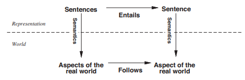
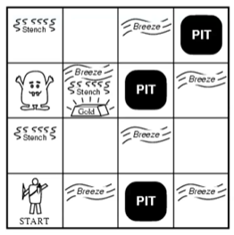

**Author:** Beatrice Occhiena s314971. See [`LICENSE`](https://github.com/beatrice-occhiena/Computational_intelligence/blob/main/LICENSE) for details.
- institutional email: `S314971@studenti.polito.it`
- personal email: `beatrice.occhiena@live.it`
- github repository: [https://github.com/beatrice-occhiena/Computational_intelligence.git](https://github.com/beatrice-occhiena/Computational_intelligence.git)

**Resources:** These notes are the result of additional research and analysis of the lecture material presented by Professor Giovanni Squillero for the Computational Intelligence course during the academic year 2023-2024 @ Politecnico di Torino. They are intended to be my attempt to make a personal contribution and to rework the topics covered in the following resources.
- [https://github.com/squillero/computational-intelligence](https://github.com/squillero/computational-intelligence)
- Lessons: 18/12/2023, 19/12/2023
- Stuart Russel, Peter Norvig, *Artificial Intelligence: A Modern Approach* [3th edition]
- [https://www.youtube.com/Knowledge-Based-Agents](https://www.youtube.com/watch?v=USjMRUp-iGc)

.

.

# Logical Agents

## Table of Contents
- [Introduction](#introduction)
- [Key Concepts](#key-concepts)
  - [Knowledge Representation](#knowledge-representation)
  - [Logical Reasoning](#logical-reasoning)
  - [Inference Algorithm](#inference-algorithm)
- [Knowledge-Based Agents](#knowledge-based-agents)
  - [Pseudo-code](#pseudo-code)
  - [The Wumpus World](#the-wumpus-world)
- [Logic Systems](#logic-systems)
  - [Propositional Logic (PL)](#propositional-logic-pl)
  - [First-Order Logic (FOL)](#first-order-logic-fol)
  - [Fuzzy Logic (FL)](#fuzzy-logic-fl)


## Introduction
Logical agents are agents that can reason using formal logic. They are based on the idea of using acquired knowledge to draw conclusions about the world. 

They:
 1. Store some `declarative representation` of complex knowledge about the world.
 2. Have an `inference mechanism` to derive new information combining pre-existing knowledge with new perceptions.
3. Use the derived information to `make good decisions`.

> 🎯 The goal is to build a system that can reason about the world and make decisions based on the information it gathers along the way from the environment.

## Key Concepts

### Knowledge Representation
> **OB:** 👨🏻 Human knowledge **-translated->** 💻 Computer-translatable form
- Knowledge Representation **Language**:
  - `Syntax`: define the set of all possible sentences that can be expressed in the language using its symbols.
  - `Semantics`: define the truth-value of a sentence.
- **Sentence**: a statement about the world that can be true or false.
- **Model** of a sentence: a possible world in which the sentence is true.
  - $M(s)$: the set of all models where $s$ is true.

### Logical Reasoning
> **OB:** Premises **-inference-rules->** Conclusions
- `Deductive reasoning`: conclusions are entailed by the premises.
- `Inductive reasoning`: conclusions are supported by the premises.
- `Abductive reasoning`: conclusions are the best explanation for the premises.

- **Entailment (⊨)** guarantees that the conclusion is true if the premises are true.
  - $s_1, s_2, \dots, s_n \models s$ means that $s$ is true in all models where $s_1, s_2, \dots, s_n$ are true.
  - $M(s_1, s_2, \dots, s_n) \subseteq M(s)$
  - e.g.
    - $(x = 0) \models (xy = 0)$
    - $(s1 = True) \models (s1 \lor s2)$

### Inference Algorithm
> **OB:** Old knowledge **-derive->** New sentences

Domain-independent procedure characterized by:
- **Soundness**: only deriving entailed sentences (i.e. no contradictions)
- **Completeness**: derive all entailed sentences.

## Knowledge-Based Agents


A knowledge-based agent is composed of:
- **Perceptions**: the agent's perceptual inputs at any given instant.
  - $\mathcal{P} = \{p_1, p_2, \dots, p_n\}$
- **Knowledge Base**: repository of domain-specific content, composed by a set of sentences in a KR-language. 
  - $\mathcal{KB} = \{s_1, s_2, \dots, s_n\}$
  - `TELL`: add a sentence to the KB
- **Inference Engine**: a domain-independent algorithm for deriving new sentences from the knowledge base. $\mathcal{KB} \models s$
  - `ASK`: query the KB
- **Actuator**: the agent's actions at any given instant.
  - $\mathcal{A} = \{a_1, a_2, \dots, a_n\}$

### Pseudo-code
```python
def KB-Agent(percept):
  KB = TELL(KB, make-percept-sentence(percept))
  action = ASK(KB, make-action-query())
  return action
```

### The Wumpus World


The Wumpus World is a simple environment that is used to illustrate the logical agents. It is a cave consisting of rooms connected by passageways. 
- The agent has to find the gold and return to the starting position. 
- The environment is inhabited by a Wumpus monster and a number of pits, which are both fatal to the agent.
- The agent has a limited number of arrows to kill the Wumpus. 

The agent has to reason about the world and make decisions based on the information it gathers from the environment.

Local perception:
- 💩 `Stench`: the agent perceives a stench in the room if the Wumpus is in a neighboring room.
- 🌬️ `Breeze`: the agent perceives a breeze in the room if there is a pit in a neighboring room.
- ✨ `Glitter`: the agent perceives a glitter in the room if there is gold in the room.
- 🧱 `Bump`: the agent perceives a bump if it walks into a wall.
- 😱 `Scream`: the agent perceives a scream if the Wumpus is killed.

Actions:
- `Forward`: the agent moves forward in the direction it is facing.
- `TurnLeft`: the agent turns left.
- `TurnRight`: the agent turns right.
- `Grab`: the agent picks up the gold.
- `Climb`: the agent climbs out of the cave.
- `Shoot`: the agent shoots an arrow in the direction it is facing.

Rewards:
- `+1000`: the agent receives a reward of 1000 if it picks up the gold.
- `-1`: the agent receives a penalty of 1 for each action it takes.`
- `-10000`: the agent receives a penalty of 1000 if it falls into a pit or is eaten by the Wumpus.

## Logic Systems

### Propositional Logic (PL)

Propositional Logic (PL) is a formal language for representing knowledge about the world in terms of atomic sentences and logical connectives.

- **Propositional Symbols**: atomic sentences that can be true or false.
  - $p, q, r, \dots$
- **Connectives**: operators that combine sentences into more complex sentences.
  - $\neg, \land, \lor, \implies, \iff$
- **Truth Tables**: define the truth-value of a sentence given the truth-value of its components.

### First-Order Logic (FOL)

First-Order Logic (FOL), also known as Predicate Logic, extends propositional logic by introducing new elements, allowing for more expressive statements about the world.

1. **Objects**: genreal entities in the world with individual identities.
    - Can be concrete (e.g. people, cars, etc.) or abstract (e.g. numbers, sets, etc.).

2. **Properties**: characteristics of objects.
    - Can be intrinsic (e.g. color, size, etc.) or relational (e.g. tall, heavy, etc.).

3. **Relations**: properties that hold between objects.
    - Can be binary (e.g. father of, bigger than, etc.) or n-ary (e.g. between, etc.).
    - `Functions`: subset of relations that map each object to exactly one object (e.g. father of, etc.).

4. **Quantifiers**:
   - **Universal Quantifier (∀)**: Indicates that a statement holds for all objects in the domain.
   - **Existential Quantifier (∃)**: Indicates that a statement holds for at least one object in the domain.
 
### Fuzzy Logic (FL)

Fuzzy Logic (FL) is a formal language for representing knowledge about the world in terms of atomic sentences and logical connectives.

> 💡 The key idea is that the **degree of truth** of a sentence is a real number in the interval `[0, 1]`.
- $NOT A \implies 1 - A$
- $A \land B \implies min(A, B)$
- $A \lor B \implies max(A, B)$

Introdued in 1965 by Lotfi Zadeh, FL is based on the concept of **fuzzy set**, which is a set whose elements have varying degrees of membership.

It allows for reasoning with ` imprecise information` by assigning degrees of truth to propositions rather than strictly binary true or false values.
- **More nuanced decision-making** in situations where traditional binary logic may not *adequately capture the complexity of real-world conditions*.

  Instead of saying:
  - "the employee knows the language" (true or false)
  
  We can say:
  - "the employee knows the language to a degree of 0.8".