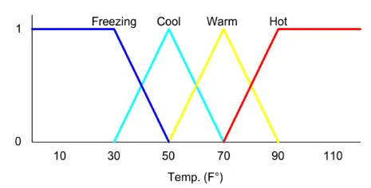
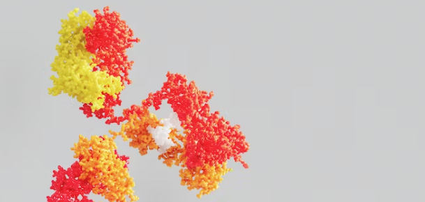

**Author:** Beatrice Occhiena s314971. See [`LICENSE`](https://github.com/beatrice-occhiena/Computational_intelligence/blob/main/LICENSE) for details.
- institutional email: `S314971@studenti.polito.it`
- personal email: `beatrice.occhiena@live.it`
- github repository: [https://github.com/beatrice-occhiena/Computational_intelligence.git](https://github.com/beatrice-occhiena/Computational_intelligence.git)

**Resources:** These notes are the result of additional research and analysis of the lecture material presented by Professor Giovanni Squillero for the Computational Intelligence course during the academic year 2023-2024 @ Politecnico di Torino. They are intended to be my attempt to make a personal contribution and to rework the topics covered in the following resources.
- [https://github.com/squillero/computational-intelligence](https://github.com/squillero/computational-intelligence)
- Stuart Russel, Peter Norvig, *Artificial Intelligence: A Modern Approach* [3th edition]
- https://en.wikipedia.org/wiki/Computational_intelligence
- https://medium.com/it-paragon/fuzzy-logic-approximating-imprecise-statement-54d444237820

## Computational Intelligence
Computational Intelligence is a multidisciplinary field at the intersection of computer science, biology, and engineering. It explores the `development of intelligent systems` capable of solving complex problems and adapting to dynamic environments.

### Nature-Inspired Methodologies
Computational intelligence draws inspiration from natural and biological processes. It mimics the problem-solving approaches observed in nature. It involves developing AI systems that can `adapt to changing environments` and `learn from experience` to `solve complex problems`.
- **Evolutionary Computation** These techniques simulate the principles of natural selection, genetic recombination, and mutation to evolve and improve solutions over successive generations.
  - `Learning` is often a part of the evolutionary process. As populations of potential solutions evolve, individuals that perform better are more likely to be selected to produce offspring. Learning mechanisms, such as *adaptation and improvement*, occur at the level of individual solutions within the population. But over time, the population as a whole becomes better at solving the given problem as the fittest solutions are retained and used as parents for the next generation.
- **Swarm Intelligence** These techniques simulate the collective behavior of social insects and animals to solve complex problems. They involve the coordination of multiple agents to achieve a common goal.

  

### Complexity Beyond Mathematical Reasoning
Many real-world problems are inherently complex and cannot be effectively solved through traditional mathematical modeling alone.
- **Fuzzy logic** It involves representing and reasoning with `imprecise and uncertain information`. It is useful for modeling `human reasoning` and `linguistic concepts` that are not easily quantifiable.

  

### Multi-agent Systems
Multi-agent systems involve multiple agents that interact with each other to achieve a common goal. They are useful for modeling complex systems that involve multiple entities and interactions between them.
- **Artificial immune systems** These techniques simulate the behavior of the human immune system to solve complex problems. They involve the use of `pattern recognition` and `learning` to detect and eliminate foreign bodies or pathogens.

  

## AI Approaches
When developing an AI approach, it's crucial to ask two fundamental questions that shape how we approach AI research and development. We must consider whether the approach aligns with our objectives and if it's *ethical* and *accountable to society*. By prioritizing these questions, we can create a clear and effective strategy while ensuring ethical responsibility. 

- **Thinking vs. Behavior** Are we focused on comprehending and `mirroring human thought processes` and reasoning, or are we primarily concentrated on `accomplishing definite tasks` or behaviors through AI systems?

- **Human Model vs. Ideal Standard** Do we aim to model AI after `human` thinking and behavior, or are we striving for an `ideal standard` that exceeds human capabilities?

### Different finalities
For this reason, we can divide AI into four categories based on these two questions:

1. **Thinking Humanly** This approach aims to create AI systems that replicate human thought processes and reasoning. It endeavors to `model cognitive functions` and understand the mechanisms of human intelligence. Researchers adopting this approach often investigate *psychology* and *cognitive science* to inform AI design.
2. **Thinking Rationally** It involves developing AI systems capable of following logical and *rational reasoning pathways* to reach accurate conclusions. It focuses on applying *formal logic* and problem-solving techniques to enable AI systems to make informed deductions and `draw logical conclusions`.
3. **Acting Humanly** In this approach, the objective is to develop AI systems that can `imitate human behavior` and actions. The focus is on attaining human-like performance in tasks and activities. This typically requires *natural language comprehension*, *speech detection*, and *computer vision* to enable AI systems to communicate with humans in a human-like manner.
4. **Acting Rationally** The acting rationally approach emphasizes creating AI systems capable of `executing specific tasks optimally`. This approach prioritizes determining the *best course of action* to attain the intended results rather than simulating human thought or behavior, often involving *decision-making algorithms* and *optimization techniques*.

### Different scopes
- **Narrow/weak AI** It involves developing AI systems that can perform specific tasks and activities. It focuses on creating AI systems that can `accomplish a single task` or `solve a specific problem`.
- **General/strong AI** It involves developing AI systems that can perform any task or activity a human can. It focuses on creating AI systems that can `generalize across tasks and domains` and perform any activity a human can. So far, this type of AI has not been achieved and is still a theoretical concept.

### Different paradigms
1. **Symbolic AI** It involves the `conscious processing` of information using symbols and rules. It relies on symbolic representation and manipulation of knowledge.
    - Knowledge is represented using `symbols`, and reasoning is based on `symbolic logic`. This approach emphasizes *explicit and structured representation of information*.
    - It produces `explainable results` because the reasoning process is based on *transparent* symbolic rules. It is easier to understand and *trace the decision-making process*.
    - Examples include *expert systems* and *knowledge graphs*.
2. **Sub-symbolic AI** It involves the `unconscious processing` of information using neural networks and interconnected nodes or neurons. It focuses on learning patterns from data.
    - Knowledge is represented as `distributed patterns of activation across interconnected nodes`. It often deals with *patterns* and *statistical relationships* in data.
    - It tends to be less explainable because it operates as a `black box`. The reasoning process involves complex, distributed computations that are challenging to interpret.
    - Examples include *deep learning* and *neural networks*.
3. **Neuro-symbolic AI** It involves the `combination of symbolic and sub-symbolic AI`. It focuses on combining the strengths of both approaches to create more powerful AI systems. It aims to *strike a balance between explainability and performance*.
    - Examples of neuro-symbolic AI are emerging in fields like *natural language understanding* and *robotics*.